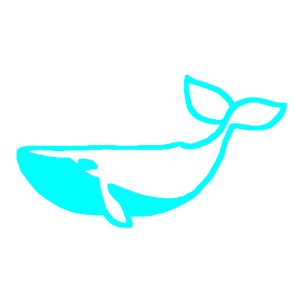

<div align="center">
  
</div>

# Telita

Telita is a cross-platform, high-performance media player designed for seamless streaming and robust local playback. Built with a Flutter frontend and a high-performance Go core, it delivers a consistent and premium media experience across desktop mobile and televisions.

## Features

*   **Cross-Platform Support**: Works seamlessly on Windows, Android mobile, and Android TV.
*   **Torrent Streaming**: Built-in Go backend for fast, on-the-fly peer-to-peer media streaming.
*   **Stremio Addon Ecosystem**: Fully compatible with the Stremio addon architecture, allowing you to easily browse and stream community content.
*   **Cloud Sync**: Automatically syncs your watch history, playlists, and profiles across devices.
*   **Multi-Profile Support**: Create up to 5 individual user profiles under a single account.
*   **Hardware Acceleration**: Uses native media players for smooth, battery-friendly playback.
*   **Customizable UI**: Features a clean, dynamic interface with an OLED dark mode and advanced subtitle settings.

## Development Notes

### Architecture Overview
The application consists of two main components:
1.  **Core (Go)**: A local streaming server and torrent client that handles heavy network operations and peer-to-peer logic.
2.  **Frontend (Flutter)**: The user interface and native media player implementation (utilizing media_kit).

### Building the Go Core
Before building the Flutter application, you must compile the native core binaries.

#### Windows (libcore.exe)
1. Ensure you have Go 1.22 or higher installed.
2. Navigate to the `core` directory.
3. Build the executable:
   ```bash
   go build -buildmode=exe -ldflags="-s -w" -o libcore.exe main_standalone.go
   ```

#### Android (libcore.so)
1. Ensure you have the Android NDK installed and configured.
2. Navigate to the `core` directory.
3. Build the shared library utilizing the NDK toolchain:
   ```bash
   CGO_ENABLED=1 CC=$NDK_PATH/toolchains/llvm/prebuilt/windows-x86_64/bin/aarch64-linux-android33-clang go build -buildmode=c-shared -ldflags="-s -w" -o libcore.so android.go
   ```

### Building the Flutter App
Once the core binaries are placed in their respective directories (the root directory for Windows, and `android/app/src/main/jniLibs/arm64-v8a/` for Android), you can build the frontend.

1. Navigate to the `telita_flutter` directory.
2. Install dependencies:
   ```bash
   flutter pub get
   ```
3. Build the application for your target platform:
   ```bash
   # For Windows
   flutter build windows

   # For Android
   flutter build apk
   ```

## License

This project is licensed under the MIT License. See the LICENSE file for details.

## Disclaimer

Telita is purely a media player software. The developers strictly condemn the streaming, downloading, or distribution of copyrighted media without permission. Users are solely responsible for the content they choose to access through this software. The developers of Telita do not endorse, promote, or facilitate piracy in any form.
